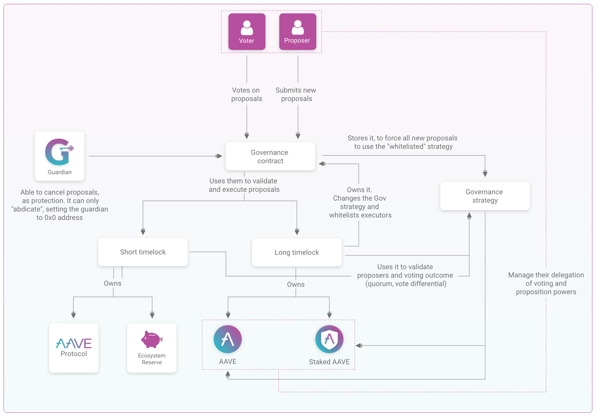

# Aave Governance v2

## Architecture



## Planned configurations for mainnet

### AaveGovernanceV2
- governanceStrategy = GovernanceStrategy, based on AAVE and stkAAVE
- votingDelay = 1 block
- guardian = multisig contract
- executors = 2 different, a short/less strict timelock and a long/more strict one
- owner = Executor (long)

### Executor (short)
- admin = the AaveGovernanceV2
- delay = 1 day
- gracePeriod = 3 days
- minimumDelay = 1 day
- maximumDelay = 3 days
- propositionThreshold = 1%
- voteDuration = 3 days
- voteDifferential = 0.5%
- minimumQuorum = 2%

### Executor (long)
- admin = the AaveGovernanceV2
- delay = 2 days
- gracePeriod = 7 days
- minimumDelay = 1 day
- maximumDelay = 7 days
- propositionThreshold = 2%
- voteDuration = 7 days
- voteDifferential = 15%
- minimumQuorum = 20%

### GovernanceStrategy
- With AAVE and stkAAVE as voting assets


## Setup

The repository uses Docker Compose to manage sensitive keys and load the configuration. Prior any action like test or deploy, you must run `docker-compose up` to start the `contracts-env` container, and then connect to the container console via `docker-compose exec contracts-env bash`.

Follow the next steps to setup the repository:

- Install `docker` and `docker-compose`
- Create an enviroment file named `.env` and fill the next enviroment variables

```
# Mnemonic, only first address will be used
MNEMONIC=""

# Add Alchemy or Infura provider keys, alchemy takes preference at the config level
ALCHEMY_KEY=""
INFURA_KEY=""

# Your access token from Gitlab, with the api scope enabled, to install @aave-tech/aave-token package from Gitlab Package Registry. Check this guide to get one https://docs.gitlab.com/ee/user/profile/personal_access_tokens.html
GITLAB_ACCESS_TOKEN=""

# Optional Etherscan key, for automatize the verification of the contracts at Etherscan
ETHERSCAN_KEY=""

# Optional, if you plan to use Tenderly scripts
TENDERLY_PROJECT=""
TENDERLY_USERNAME=""

```

## Test

For running the test suite, run:

```
docker-compose run contracts-env npm run test
```

For running coverage, run:

```
docker-compose run contracts-env npm run coverage
```